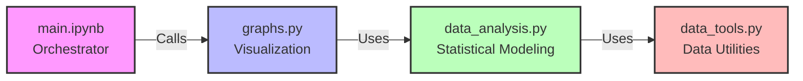

# Neuro-Data Analysis: Socio-Educational Background vs. Reasoning & Math Skills

## 👥 Presenters
* **Yair Olmayev**
* **Roy Carmelli**
* **Ben Kopler**
* **Matan Spiegel**

---

## 1. 🔬 General Research Overview

This project investigates the relationship between a child’s **socio-educational environment** (e.g., parental background, school context) and their **cognitive/academic outcomes**, with a specific focus on **mathematical achievement** and **deductive reasoning**.

### 📚 Data Sources
*   **Main Dataset:** [main_dataset.csv](https://github.com/yair3230/python-final-project/blob/master/main_dataset.csv) (Subject-level background & cognitive summaries).
*   **Behavioral Logs:** [trial_data/](https://github.com/yair3230/python-final-project/tree/master/trial_data) (Trial-level performance data).
*   **Data Dictionary:** [data_description.json](https://github.com/yair3230/python-final-project/blob/master/data_description.json).
*   **Original Source:** OpenNeuro [ds002886](https://openneuro.org/datasets/ds002886/versions/1.1.0) (*Brain Development and Reasoning*).

### 🔍 Initial Findings & Demographics
*   **Subjects:** 56 total participants.
*   **Attrition:** **19% (11 subjects)** did not attend the second session.
*   **Missing Data:**
    *   ADHD data missing for 4 subjects (7.1%).
    *   CMAT (Math) data missing for 18 subjects (32.1%).
*   **Handedness:** Non-diverse (100% right-handed).

---

## 2. ❓ Research Questions

### The Core Question
How does the **socio-educational context** (SES, parental professional background, school characteristics) relate to **mathematical performance** and **deductive reasoning**? Does this relationship remain significant even after **controlling for individual cognitive variables** (VIQ, PIQ, Working Memory)?

### Rationale
*   **Behavioral vs. Neural:** Unlike prior studies on this dataset that focused on neural correlates (fMRI) of reasoning, this project adopts a **behavioral-social perspective**.
*   **Nurture vs. Nature:** We aim to quantify the incremental contribution of the *environment* to the development of specific thinking skills (Math and Logic).

---

## 3. 📝 Definitions & Key Terms

*   **LISAS (Linear Integrated Speed-Accuracy Score):** A metric combining response time (RT) and error rate to account for speed-accuracy tradeoffs in reasoning tasks.
    *   *Formula used:* $RT_{mean} + \frac{S_{RT}}{S_{PE}} \times PE$ (where PE is error rate).
*   **VIQ (Verbal IQ):** Measure of verbal reasoning ability.
*   **PIQ (Performance IQ):** Measure of non-verbal reasoning and spatial ability.
*   **SES (Socio-Economic Status):** Composite metric derived from parental income and education.
*   **ISCO:** International Standard Classification of Occupations, used to map parental jobs to "STEM vs. Humanities" scores.
*   **Cognitive Bias:** The directional difference between a child's quantitative (STEM) and verbal skills.

---

## 4. 🗺️ Roadmap & Methodology

### A. Data Engineering
*   **Log Processing:** Extracted raw logs from `trial_data/`. computed LISAS scores per subject.
*   **Feature Engineering:**
    *   Mapped text-based occupation data to numerical **ISCO** scores.
    *   Aggregated sub-scales into composite **Math**, **Verbal**, and **Memory** Z-scores.
*   **Data Integration:** Merged calculated metrics with `main_dataset.csv`.

### B. Exploratory Data Analysis (EDA)
*   **Hypothesis:**
    *   Humanities-oriented parents $\rightarrow$ Stronger Child **Verbal** skills.
    *   STEM-oriented parents $\rightarrow$ Stronger Child **Mathematical** skills.
*   **Visualizations:** Generated Spearman correlation heatmaps and scatter plots verifying distributions and outliers.

### C. Statistical Modeling (Hierarchical Regression)
*   **Stage 1 (Baseline):** OLS Model predicting outcomes using only **Cognitive** variables (IQ, Memory).
*   **Stage 2 (Extended):** Added **Socio-educational** variables (Parental Education, SES, Class Type).
*   **Evaluation:** Tested for statistically significant increase in $R^2$ (Explained Variance).
*   **Diagnostics:** Analyzed residuals for normality and homoscedasticity; checked for high leverage points.

---

## 5. ⚖️ Assumptions & Constraints

1.  **Cross-Sectional Validity:** Due to significant attrition in Session 2 (19%), the analysis rigorously uses only **Session 1** data to maintain statistical power and consistency.
2.  **Missing Data Handling:** Subjects with critical missing cognitive scores (e.g., CMAT) are excluded from specific models rather than imputed, to avoid introducing synthetic bias in a small dataset (N=56).
3.  **Occupation Mapping:** The mapping of parental occupations to "STEM/Humanities" scores is an approximation based on ISCO standards and may not capture all professional nuances.

---

## 6. 📊 Recent Analysis & Results

We have implemented an integrated analysis pipeline (`data_analysis.py`) used by `main.ipynb` to generate the following insights:
*   **Parental Bias Index:** A standardized score reflecting the parents' vocational orientation.
*   **Correlation Checks:**
    *   Parental Bias vs. Child's **Real/STEM** abilities.
    *   Parental Bias vs. Child's **Verbal/Humanistic** abilities.
    *   **Result:** Visualizations provided in the final report demonstrate the strength and direction of these relationships.

---

## 7. 🧱 Project Structure



*   **`main.ipynb`**: Orchestrator notebook. Executes the full pipeline and renders visualizations.
*   **`data_analysis.py`**: Core logic engine (Loading, Scoring, Modeling, Feature Org).
*   **`graphs.py`**: Visualization library (Heatmaps, Scatter plots, Residual plots).
*   **`data_tools.py`**: Data utilities for handling raw datasets.
*   **`consts.py`**: Project constants and variable definitions.

---

## 💻 How to Run

1.  **Install Dependencies:**
    ```bash
    pip install -r requirements.txt
    ```
2.  **Execute Analysis:**
    *   Open `main.ipynb` in Jupyter/VS Code.
    *   Run all cells sequentially. The notebook will:
        1.  Load and process trial data.
        2.  Merge datasets.
        3.  Compute correlations.
        4.  Run OLS regression models.
        5.  Display all final plots.
